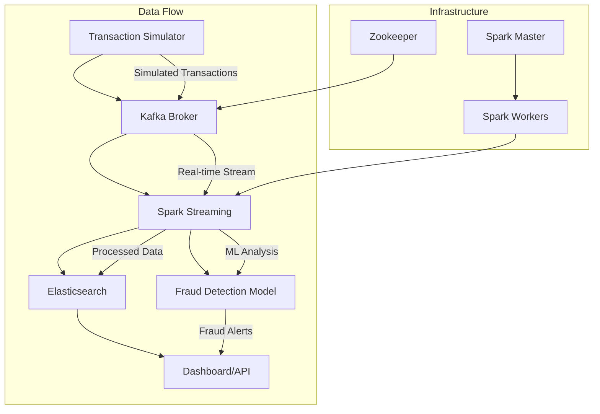

# M-Pesa Streaming Pipeline

## Project Overview

Real-time streaming pipeline for simulated M-Pesa transactions with fraud detection capabilities. This project processes mobile money transactions in real-time, analyzes patterns, and identifies potentially fraudulent activities using machine learning.

## Tech Stack

- **Apache Kafka**: Distributed streaming platform for real-time data ingestion
- **PySpark Streaming**: Real-time data processing and stream analytics
- **Elasticsearch**: Search and analytics engine for storing and querying transaction data
- **scikit-learn**: Machine learning library for fraud detection algorithms
- **Docker**: Containerization for consistent development and deployment

## Architecture Diagram



## Setup

### Local Development with Docker

1. **Prerequisites**
   - Docker Desktop installed
   - Python 3.8+ installed
   - Git installed

2. **Clone the repository**
   ```bash
   git clone https://github.com/CippyCabana1109/mpesa-streaming-pipeline.git
   cd mpesa-streaming-pipeline
   ```

3. **Start the infrastructure**
   ```bash
   docker-compose up -d
   ```

4. **Install Python dependencies**
   ```bash
   pip install -r requirements.txt
   ```

5. **Verify setup**
   - Kafka Broker: `localhost:9092`
   - Elasticsearch: `http://localhost:9200`
   - Spark Master UI: `http://localhost:8080`

### Optional: Confluent Cloud

For production deployment, you can use Confluent's free tier:
- Sign up at [Confluent Cloud](https://www.confluent.cloud/)
- Create Kafka cluster
- Update connection details in configuration files

## Usage

### 1. Start Transaction Simulation
```bash
python src/simulate/transaction_generator.py
```

### 2. Run Data Ingestion
```bash
python src/ingest/kafka_producer.py
```

### 3. Start Stream Processing
```bash
python src/process/spark_streaming.py
```

### 4. Launch Data Storage
```bash
python src/store/elasticsearch_sink.py
```

### 5. Monitor Results
- Check Elasticsearch indices: `http://localhost:9200/_cat/indices`
- View Spark UI: `http://localhost:8080`
- Query transaction data via Elasticsearch API

## Project Structure

```
mpesa-streaming-pipeline/
├── src/
│   ├── simulate/          # Transaction simulation scripts
│   ├── ingest/            # Kafka producers for data ingestion
│   ├── process/           # Spark streaming jobs
│   └── store/             # Elasticsearch sink and storage
├── data/
│   └── simulated/        # Sample data and outputs
├── docker-compose.yml     # Infrastructure setup
├── requirements.txt       # Python dependencies
└── README.md             # Project documentation
```

## Features

- **Real-time Transaction Processing**: Sub-second latency for transaction analysis
- **Fraud Detection**: Machine learning models identify suspicious patterns
- **Scalable Architecture**: Horizontal scaling with Kafka and Spark
- **Data Persistence**: Elasticsearch provides fast search and analytics
- **Monitoring**: Built-in metrics and health checks

## Development

### Adding New Features
1. Create feature branch: `git checkout -b feature/new-feature`
2. Make changes and test locally
3. Update documentation
4. Submit pull request

### Testing
```bash
# Run unit tests
python -m pytest tests/

# Run integration tests
python -m pytest tests/integration/
```

## Configuration

Key configuration files:
- `config/kafka_config.json`: Kafka connection settings
- `config/spark_config.json`: Spark job configurations
- `config/elasticsearch_config.json`: Elasticsearch connection details

## Contributing

1. Fork the repository
2. Create a feature branch
3. Make your changes
4. Add tests for new functionality
5. Submit a pull request

## License

This project is licensed under the MIT License - see the LICENSE file for details.
